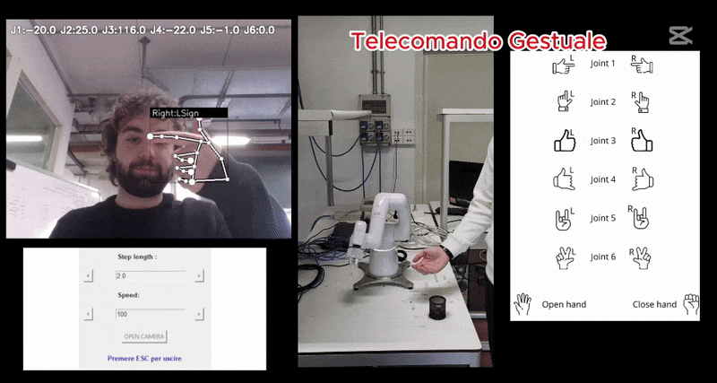

#  Multiple Cobotta Remote Controls

This project provides a multi-modal control system for the collaborative robot **Cobotta** from DENSO. Users can interact with the robot using three different control modes:

- **Virtual Remote Control** – Joint manipulation via on-screen buttons.
- **Hand Gesture Control** – Robot control using hand movements.
- **Voice Control** – Safe and robust voice-based interaction.

All modes can run simultaneously.

To launch the application:
1. Ensure all dependencies in `requirements.txt` are installed.
2. Navigate to the project directory.
3. Run `app.py`.

### Control Mode 1: Virtual Remote (GUI)

A graphical interface provides a virtual remote control for Cobotta, allowing users to move individual joints using on-screen buttons.

- **Joint Control**: Each joint can be moved in discrete steps, with customizable step size through a multiplier for coarse or fine adjustments.
- **Speed Adjustment**: Movement speed is user-configurable, affecting both acceleration and deceleration for smooth motion.
- **Limit Protection**: Commands are constrained within safe joint ranges. Buttons automatically disable at limits to prevent errors.
- **Emergency Stop**: A clearly visible button halts all robot motion instantly by powering down the motors via a separate thread.

---

### Control Mode 2: Hand Gesture Recognition

A gesture-based control system allows users to operate Cobotta using hand movements, recognized via a webcam.

- **Gesture Commands**: Six gestures are used to control joint movement, with right and left hand differentiation indicating movement direction. Two additional gestures control gripper open/close.
- **Activation**: Start the gesture mode by pressing the camera activation button. Press `ESC` to exit.
- **Robust Detection**: Gestures must be held consistently across multiple frames to trigger actions, minimizing false positives. Joint movement limits are enforced as in other modes.
- **Training & Customization**: Gesture recognition is based on [MediaPipe Hand Gesture Recognition](https://github.com/Kazuhito00/hand-gesture-recognition-using-mediapipe). New gestures can be logged by enabling keypoint logging (`k`) and assigning class labels via number keys. Data is saved to `keypoint.csv` and labeled in `keypoint_classifier_label.csv`.

The gesture model is trained using `trainer.ipynb`, based on collected keypoints.

---

### Control Mode 3: Voice Commands

Cobotta can also be controlled via voice commands. Once the microphone is activated, the system listens for up to 60 seconds, but automatically stops earlier if the user finishes speaking.

- **Command Structure**: Speech is processed word by word, and specific **keywords** are used to trigger actions.
- **Joint Control**: Say the joint number followed by a movement command such as `"su"`, `"giù"`, `"destra"`, `"sinistra"`, `"aumenta"`, or `"diminuisci"`. Multiple instructions can be combined in a single sentence (e.g., `"giunto 2 su su, giunto 1 destra"`). The last selected joint is remembered for future commands.
- **Combined Motion**: The command `"allungati"` synchronizes movement of joints 2 and 3 for extended reach.
- **Predefined Actions**: The command `"fai canestro"` triggers a full movement sequence: lower the arm, close the gripper, move left, open the gripper, and return to the initial position—useful for repetitive tasks.
- **Exit & Emergency Stop**: Say `"esci"` or `"interrompi"` to stop voice interaction. Say `"stop"` or `"fermati"` to activate the emergency stop function.

---

### Demo: 
 

